# Sherlock - NSDockTilePlugIn

## What is NSDockTilePlugIn?

A set of methods implemented by plug-ins that allow an app’s Dock tile to be customized while the app is not running.

Customizing an application’s Dock tile when the application itself is not running requires that you write a plug-in. The plug-in’s principal class must implement the NSDockTilePlugIn protocol.

The name of the plugin is indicated by a NSDockTilePlugIn key in the application's Info.plist file.

The plugin is loaded in a system process at login time or when the application tile is added to the Dock. When the plugin is loaded, the principal class' implementation of `setDockTile(_:)` is invoked, passing an `NSDockTile` for the plug-in to customize. If the principal class implements `dockMenu()` it is invoked whenever the user causes the application's dock menu to be shown. When the dock tile is no longer valid (for example,. the application has been removed from the dock) `setDockTile(_:)` invoked with `nil`.

## Where have I seen this be used before?

`NSDockTilePlugIn` seems to have been created for Mac OS X 10.5 Leopard for iCal (now Calendar). Since Leopard, the Calendar icon displays the current date when shown in the Dock and in Launchpad. Its purpose is to run code (logic) to update its presentation showing the current date even when Calendar is not running.

It is rare to see apps use `NSDockTilePlugIn` because apps that contain one are not allowed on the Mac App Store.

# Adding `NSDockTilePlugIn` to your project

1. Add a new Target to your Mac application Xcode project.

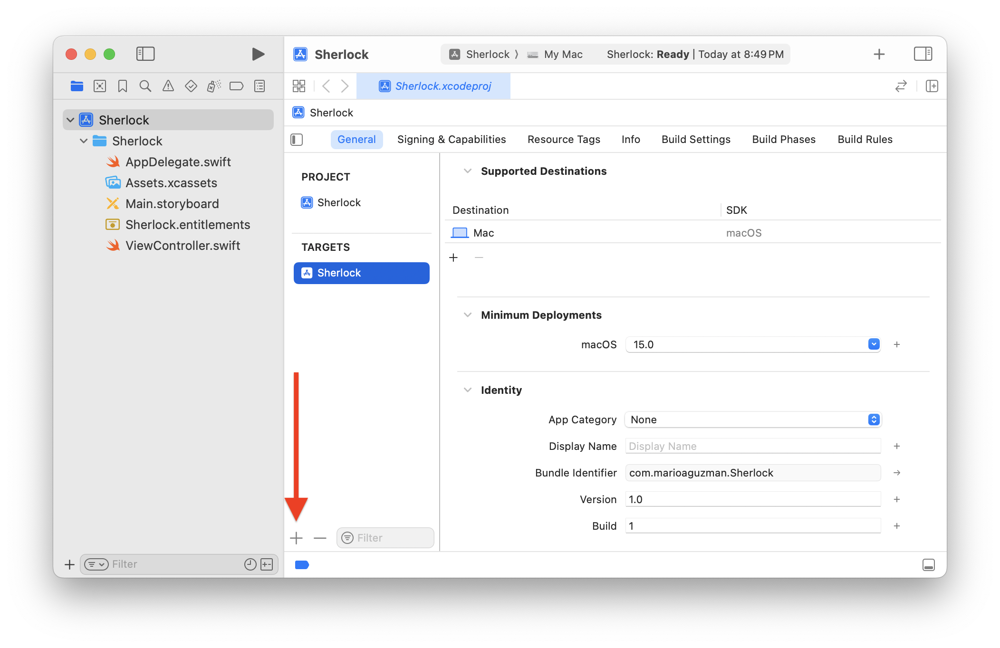

2. In the Templates sheet, click the **macOS** tab and then select **Bundle** in the **Framework & Library** section. Click **Next**.

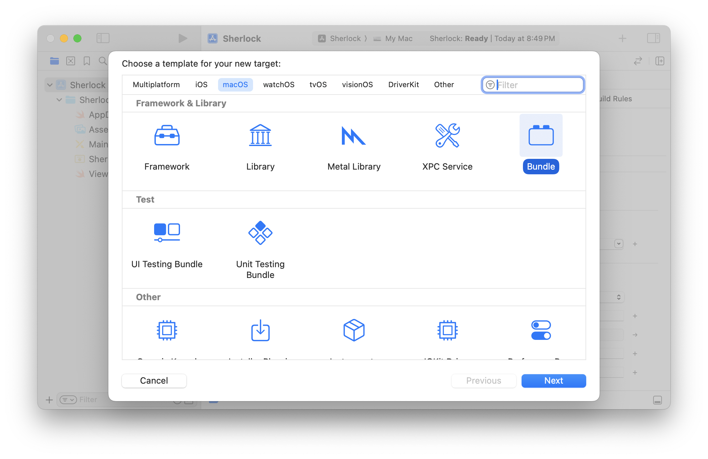

3. For convenience, name your new Target as [YourAppName]DockTilePlugIn and set the Bundle Extension to `docktileplugin`. In our example, the final name for our new Target will be “SherlockDockTilePlugIn”. Click **Finish**.

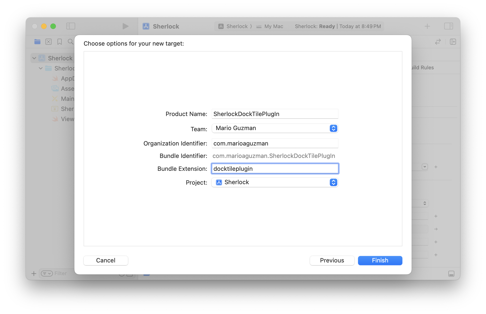

4. Xcode will not create a folder structure for this new Target. Manually create one to keep your project organized. For convenience, we are keeping the same name we’ve been using: “SherlockDockTilePlugIn”.

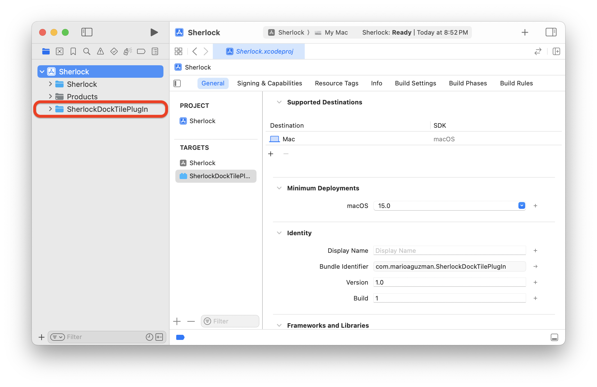

5. Select the “SherlockDockTilePlugIn” folder and add a new Swift file. Name the Swift file also “SherlockDockTilePlugIn”. Be sure that the correct Target is selected `SherlockDockTilePlugIn`.

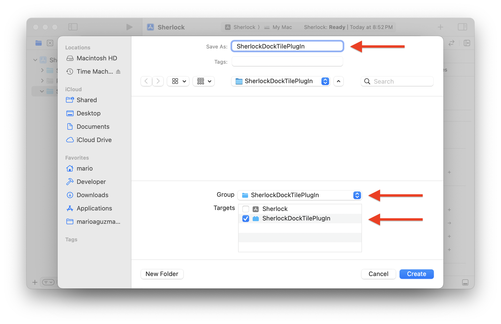

6. Select the Host app from the Targets list and click the **Info** tab. Add a new Key to your Info.plist: “Dock Tile plugin path”. Set its String value to the name we chose earlier of **[YourAppName]DockTilePlugIn** and append **.docktileplugin**. In our example, this would be “SherlockDockTilePlugIn.docktileplugin”.

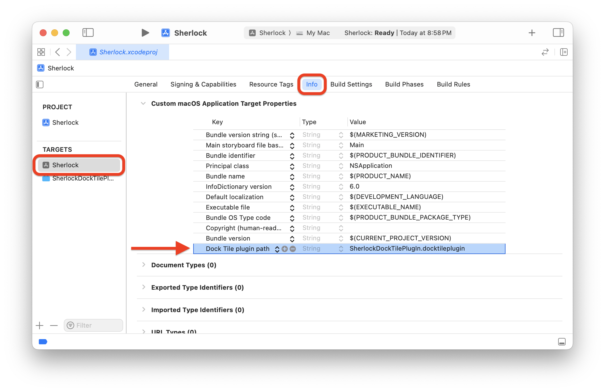

7. With the Host app still selected, click on the **Build Phases** tab. Click the **+** and choose “New Copy Files Phase”. This is to copy our NSDockTilePlugIn bundle into the Host app’s bundle. For Destination, select “PlugIns and Foundation Extensions” and add the plug-in to the list using the + symbol below.

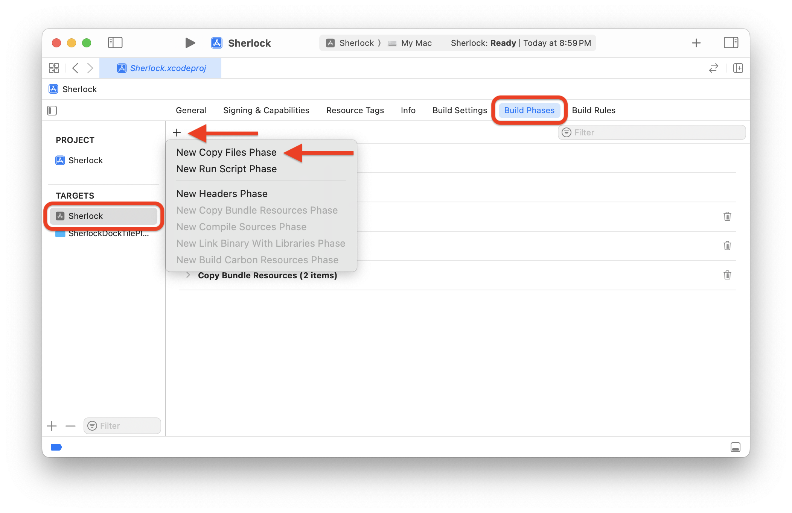
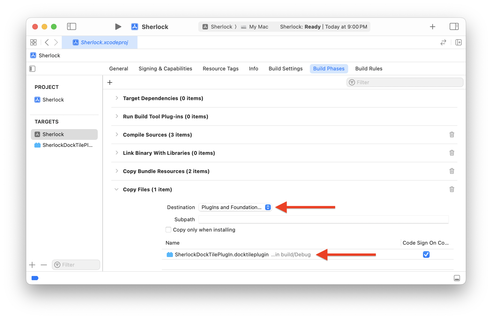

8. Select the **DockTilePlugIn** again from the Targets list and click the **Info** tab. You will see “Principal” class key already added for you but with an empty value. Add just the name of your class/file created in step 5 *without* the extension. In our case here, it will just be “SherlockDockTilePlugIn”.

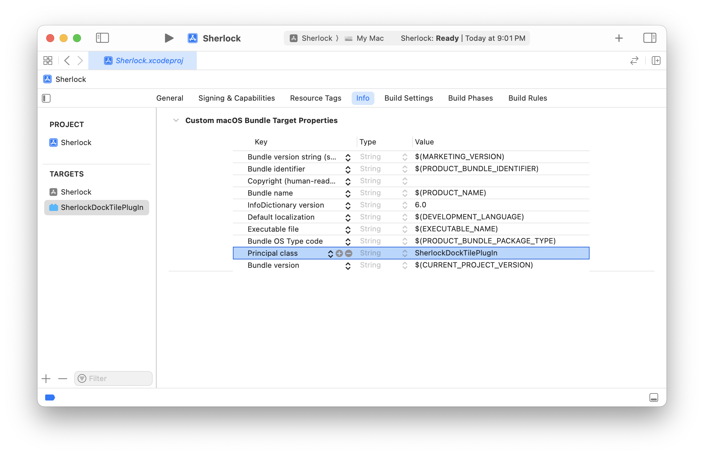

9. Open the Swift file and create your class “SherlockDockTilePlugIn”. This class must inherit from NSObject and must conform to NSDockTilePlugIn. Note: NSDockTilePlugIn requires AppKit, so make sure you add “import AppKit” to your import declarations.

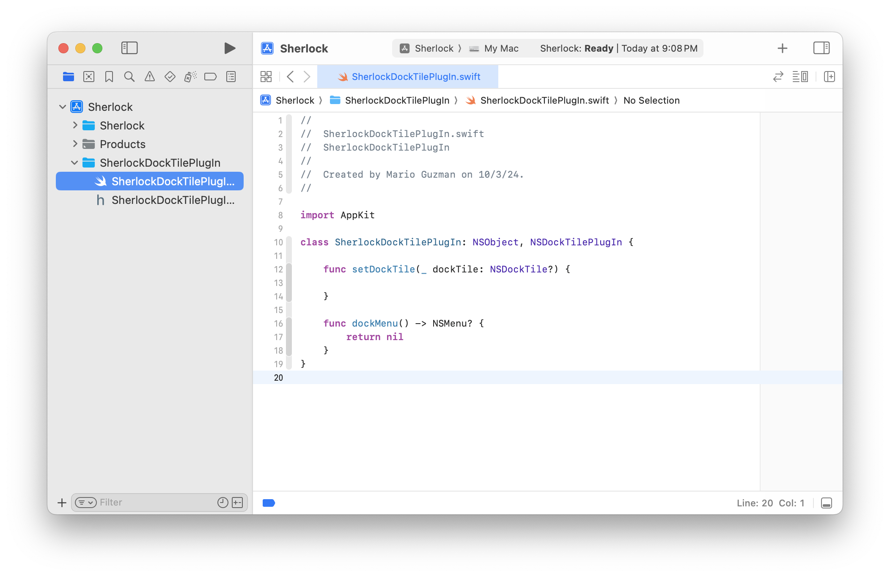

That’s all! Now we add our custom logic to have the icon do what we want it to do when the application is not running.

# What is this NSDockTilePlugIn sample going to do?

For this example, I will illustrate with code how to make it so that the app icon can change between light and dark mode when the system changes appearance and it will change when the Host app is not running.

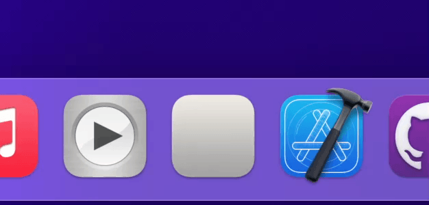

## Initial Setup

Before starting, add an `Assets.xcassets` catalog to your `NSDockTilePlugIn` Target. Add both a Light and Dark mode variant of your app icon with 128x128 and 256x256 sizes for each mode. For convenience, name them “DockTile” and “DockTile-Dark” since that is what they’re named in this code (or update the code to match your preferred asset names).

Additionally, add `import Combine` into your import declarations as this sample uses Combine Publishers.

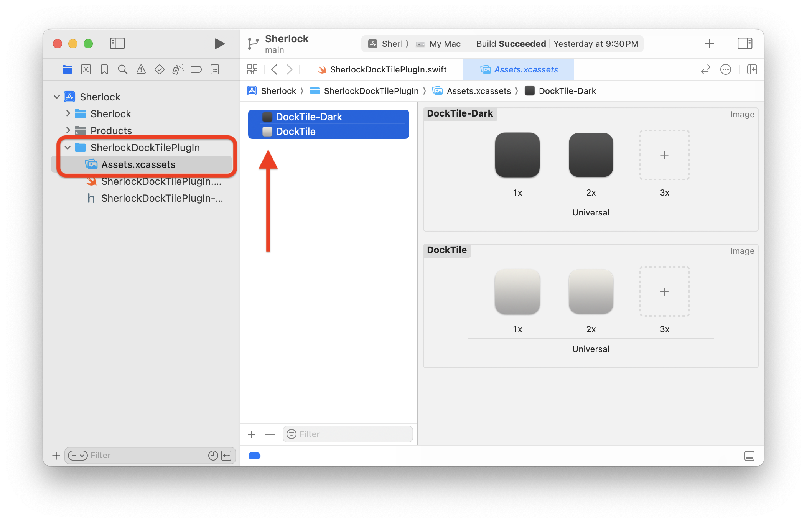

## Conforming to NSDockTilePlugIn

`NSDockTilePlugIn` protocol requires you conform to at least `setDockTile(_:)` which is what changes the appearance of your app’s Dock Tile (icon) when in the Dock.

As mentioned above in the introduction to this article, when the user drags the Host app into the Dock, this function is called with the `dockTile` parameter having a value. When the user drags the Host app’s icon out of the Dock, this function is called again with `dockTile` being `nil`.

This means, when we conform to `setDockTile(_:)`, we will have an `if-let, else` which will both update the visual appearance of the Dock icon immediately and set up a publisher to get subsequent appearance changes and will tear these publishers down in the `else` case.

The `appearancePublisher` will get updates from macOS when the user changes between light and dark mode appearances. We call the same `updateTile(tile: appearance:)` functions.

Please refer to the Xcode project for the entire code.

```swift
func setDockTile(_ dockTile: NSDockTile?) {
    if  let dockTile = dockTile {
        
        // A DockTile was provided by the system. Perform setup to listen
        // for appearance changes and system launch/termination events.
        
        // Start with an initial update to match the system immediately.
        updateTile(tile: dockTile)
        
        // Add a publisher for the appearance. Will get called whenever
        // the system appearance changes.
        appearancePublisher = NSApp.publisher(for: \.effectiveAppearance)
            .removeDuplicates()
            .sink(receiveValue: { appearance in
                self.updateTile(tile: dockTile, appearance: appearance)
            })
    } else {
        
        // Application icon was removed from the Dock. We don't need to do
        // unnecessary listening and event handling since the icon is not
        // showing in the Dock.
        
        appearancePublisher?.cancel()
        appearancePublisher = nil
    }
}
```

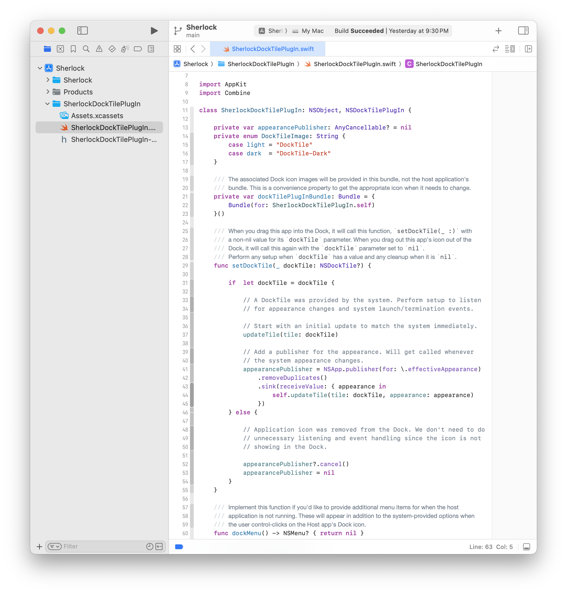

The `updateTile(tile: appearance:)` gets the appearance value passed in by the `appearancePublisher` and decides which image (for the app icon) to use. 

*NOTE: Please note that the way we grab an image is slightly different as we use the `NSDockTilePlugIn` class’ Bundle. See full code for details.*

We also pass in a parameter for the `NSDockTile`. We create a new instance of `NSImageView` with the image we want to set and set that as the `tile`’s `contentView` property. Finally, call its `display()` function to update the icon in the Dock.

```swift
private func updateTile(tile: NSDockTile, appearance: NSAppearance = NSApp.effectiveAppearance) {
    let isLightMode = appearance.bestMatch(from: [.aqua, .darkAqua]) == .aqua
    let iconName: DockTileImage = isLightMode ? .light : .dark
    
    guard let image = self.dockTilePlugInBundle.image(forResource: iconName.rawValue)
    else { return }
    
    let imageView = NSImageView(image: image)
    tile.contentView = imageView
    tile.display()
}
```

# Testing & Debugging

## Testing

Because the code you’re writing is meant to run when your application is **not** running, to test you must Build & Run your app from Xcode and then persist the Host app’s icon in the Dock by Control-Clicking on the icon, selection **Options → Keep in Dock**. Otherwise, when you quit the app, the its Dock icon will also disappear.

Change your app’s Appearance in Control Center or in System Settings. You will notice that the icon in the Dock will change accordingly.


## Debugging

I have found all suggested ways to debug this code to not work. The only way I have been successful was by using `NSLog` print statements and using Console.app to see code paths and crash errors. I have prefixed my `NSLog` strings with “~ ~” so that I can quickly filter the very noisy Console.app output.

# What about when the app *is* running?

You can also alter the icon and add additional menu items to it when the app is running. However, that is more common and *is* allowed for apps published on Mac App Store. For more information on these implementations, visit:

- [applicationDockMenu(_:)](https://developer.apple.com/documentation/appkit/nsapplicationdelegate/1428564-applicationdockmenu)
- [applicationIconImage](https://developer.apple.com/documentation/appkit/nsapplication/1428744-applicationiconimage)

# Find Me Online

- [My Website/Portfolio](https://marioaguzman.github.io/)
- [Mastodon (mastodon.social)](https://mastodon.social/@marioguzman)
- [My Music apps for Apple Music on macOS](https://marioaguzman.github.io/music) *This tutorial brought to you by my Music apps — which is where I learned how to implement `NSDockTilePlugIn`.*
